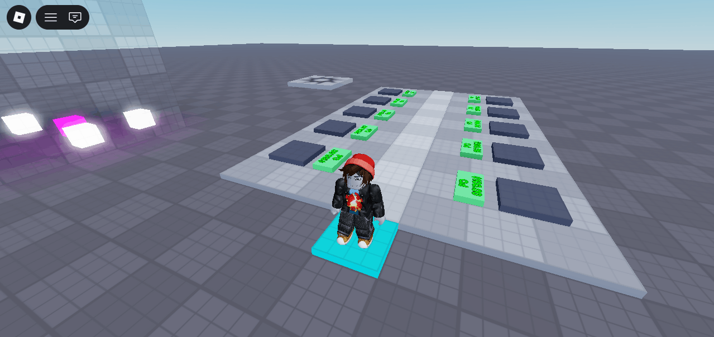

# 😵 Steal A Brainrot (Template)

> *A ready-to-use template for spinning up your own Steal A Brainrot-style game fast.*

> ⚠️ **Work in Progress** — This template is still under active development.

---

## 🎮 About

**Steal A Brainrot (Template)** is a fully-featured Roblox game template designed to get you up and running with a Steal A Brainrot clone as quickly as possible. All the core systems are built out — just drop in your assets and go.

---

## ✨ Features

- 🏠 **Player Plots** — Each player gets their own personal plot to build and defend
- 📦 **Item Spawning Area** — A shared zone where items appear for players to collect
- 💰 **Money System** — Items placed on your plot passively generate income
- 🤜 **Stealing Mechanic** — Raid other players' plots and take their items
- 🔁 **Rebirths** — Prestige system to keep progression going
- 🧩 **Template-Ready** — Clean, modular structure built for easy customization

---

## 📸 Screenshots

| |
|---|
|  |

---

## 🛠️ Built With

- **Roblox Studio**
- **Lua**

---

## 🚧 Status

This project is still a work in progress. Most core systems are functional but the template is not yet complete. Check back for updates!
